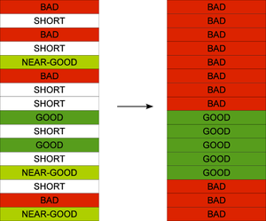

=========================================================
Description of the jusText boilerplate cleaning algorithm
=========================================================

.. contents::
  :local:

Introduction
------------

The algorithm uses a simple way of segmentation. The contents of some HTML tags
are (by default) visually formatted as blocks by web browsers. The idea is to
form textual blocks by splitting the HTML page on these tags. A sequence of two or more `` `` tags and tags below separates blocks.

- ``<blockquote>``
- ``<caption>``
- ``
``
- ``<col>``
- ``<colgroup>``
- ``<dd>``
- ``
``
- ``<dl>``
- ``<dt>``
- ``<fieldset>``
- ``<form>``
- ``<h1>``
- ``<h2>``
- ``<h3>``
- ``<h4>``
- ``<h5>``
- ``<h6>``
- ``<legend>``
- ``<li>``
- ``<optgroup>``
- ``<option>``
- ``
``
- ``<pre>``
- ``<table>``
- ``<td>``
- ``<textarea>``
- ``<tfoot>``
- ``<th>``
- ``<thead>``
- ``<tr>``
- ``<ul>``

Though some of such blocks may contain a mixture of good and boilerplate content, this is fairly rare. Most blocks are homogeneous in this respect.

Several observations can be made about such blocks:

1. Short blocks which contain a link are almost always boilerplate.
2. Any blocks which contain many links are almost always boilerplate.
3. Long blocks which contain grammatical text are almost always good whereas all other long block are almost always boilerplate.
4. Both good (main content) and boilerplate blocks tend to create clusters, i.e. a boilerplate block is usually surrounded by other boilerplate blocks and vice versa.

Deciding whether a text is grammatical or not may be tricky, but a simple
heuristic can be used based on the volume of function words (stop words). While
a grammatical text will typically contain a certain proportion of function words, few function words will be present in boilerplate content such as lists and enumerations.

The key idea of the algorithm is that long blocks and some short blocks can be
classified with very high confidence. All the other short blocks can then be
classified by looking at the surrounding blocks.

Preprocessing
-------------

In the preprocessing stage, the contents of ``<header>``, ``<style>`` and ``<script>`` tags are removed. The contents of ``<select>`` tags are immediately labeled as bad (boilerplate). The same applies to blocks containing a copyright symbol ©.

Context-free classification
---------------------------

After the segmentation and preprocessing, context-free classification is
executed which assigns each block to one of four classes:

* *bad* -- boilerplate blocks
* *good* -- main content blocks
* *short* -- too short to make a reliable decision about the class
* *near-good* -- somewhere in-between short and good

The classification is done by the following algorithm:

.. code-block:: python

  if link_density > MAX_LINK_DENSITY:
    return 'bad'

  # short blocks
  if length < LENGTH_LOW:
    if link_density > 0:
      return 'bad'
    else:
      return 'short'

  # medium and long blocks
  if stopwords_density > STOPWORDS_HIGH:
    if length > LENGTH_HIGH:
      return 'good'
    else:
      return 'near-good'
  if stopwords_density > STOPWORDS_LOW:
    return 'near-good'
  else:
    return 'bad'

The length is the number of characters in the block. The link density is defined as the proportion of characters inside ``<a>`` tags. The stop words density is the proportion of stop list words (the text is tokenized into "words" by splitting at spaces).

The algorithm takes two integers ``LENGHT_LOW`` and ``LENGTH_HIGH`` and three floating point numbers ``MAX_LINK_DENSITY``, ``STOPWORDS_LOW`` and ``STOPWORDS_HIGH`` as parameters. The former two set the thresholds for dividing the blocks by length into short, medium-size and long. The latter two divide the blocks by the stop words density into low, medium and high. The default settings are:

* ``MAX_LINK_DENSITY`` = 0.2
* ``LENGTH_LOW`` = 70
* ``LENGTH_HIGH`` = 200
* ``STOPWORDS_LOW`` = 0.30
* ``STOPWORDS_HIGH`` = 0.32

These values give good results with respect to creating textual resources for corpora. They have been determined by performing a number of experiments.

The assignment of classes for the medium and long blocks is summarised in the following table:

=========================  ===================  =========
*block size (word count)*  *stopwords density*  *class*
=========================  ===================  =========
medium-size                low                  bad
long                       low                  bad
medium-size                medium               near-good
long                       medium               near-good
medium-size                high                 near-good
long                       high                 good
=========================  ===================  =========

Context-sensitive classification
--------------------------------

The goal of the context-sensitive part of the algorithm is to re-classify the
*short* and *near-good* blocks either as *good* or *bad* based on the classes of the surrounding blocks. The blocks already classified as *good* or *bad* serve as base stones in this stage. Their classification is considered reliable and is never changed.

The pre-classified blocks can be viewed as sequences of *short* and *near-good*
blocks delimited with *good* and *bad* blocks. Each such sequence can be surrounded by two *good* blocks, two *bad* blocks or by a *good* block at one side and a *bad* block at the other. The former two cases are handled easily. All blocks in the sequence are classified as *good* or *bad* respectively. In the latter case, a *near-good*  block closest to the *bad* block serves as a delimiter of the *good* and *bad* area. All blocks between the *bad* block and the *near-good* block are classified as *bad*. All the others are classified as *good*. If all the blocks in the sequence are *short* (there is no *near-good* block) they are all classified as *bad*. This is illustrated on the following example:

The idea behind the context-sensitive classification is that boilerplate blocks
are typically surrounded by other boilerplate blocks and vice versa. The
*near-good* blocks usually contain useful corpus data if they occur close to *good* blocks. The *short* blocks are typically only useful if they are surrounded by *good* blocks from both sides. They may, for instance, be a part of a dialogue where each utterance is formatted as a single block. While discarding them may not constitute a loss of significant amount of data, losing the context for the remaining nearby blocks could be a problem.

In the description of the context-sensitive classification, one special case has been intentionally omitted in order to keep it reasonably simple. A sequence of *short* and *near-good* blocks may as well occur at the beginning or at the end of the document. This case is handled as if the edges of the documents were *bad* blocks as the main content is typically located in the middle of the document and the boilerplate near the borders.

Headings
--------
Header blocks (those enclosed in ``<h1>``, ``<h2>``, ``<h3>`` tags, etc.) are treated in a special way by jusText unless the ``NO_HEADINGS`` option is used. The aim is to preserve headings for the *good* texts.

The algorithm adds two stages of processing for the header blocks. The first stage (preprocessing) is executed after context-free classification and before context-sensitive classification. The second stage (postprocessing) is performed after the context-sensitive classification:

1. context-free classification
2. preprocessing of header blocks
3. context-sensitive classification
4. postprocessing of header blocks

The preprocessing looks for *short* header blocks which precede *good* blocks
and at the same time there is no more than ``MAX_HEADING_DISTANCE`` characters
between the header block and the *good* block. The context-free class of such
header blocks is changed from *short* to *near-good*. The purpose of this is to
preserve *short* blocks between the heading and the *good* text which might
otherwise be removed (classified as *bad*) by the context-sensitive classification.

The postprocessing again looks for header blocks which precede *good* blocks
and are no further than ``MAX_HEADING_DISTANCE`` away. This time, the matched
headers are classified as *good* if their context-free class was other than *bad*. In other words, the *bad* headings remain *bad*, but some *short* and
*near-good* headings can be classified as *good* if they precede *good* blocks,
even though they would normally be classified as *bad* by the context-sensitive
classification (e.g. they are surrounded by *bad* blocks). This stage preserves
the "non-bad" headings of *good* blocks.

Note that the postprocessing is not iterative, i.e. the header blocks re-classified as *good* do not affect the classification of any other preceding header blocks.
